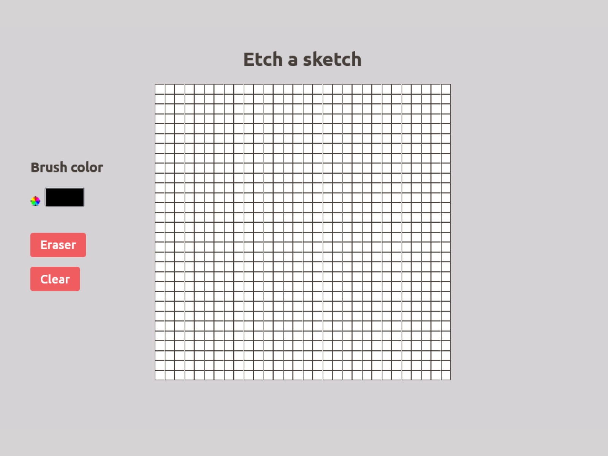

# Elementary Etch a sketch

A simple Etch a sketch made using Vanilla JS. Choose a brush color and start drawing😊

## How to use

- Click and drag on the grid to draw
- Click on the color wheel to choose a color
- Click on the clear button to clear the canvas
- Click on the erase button to erase a part on the canvas

### Author

- Kiruthiga K - [Portfolio site](https://kiruanime2003.gitlab.io/)
- My Dribbble site - [@kiruanime2003](https://dribbble.com/kiruanime2003)
